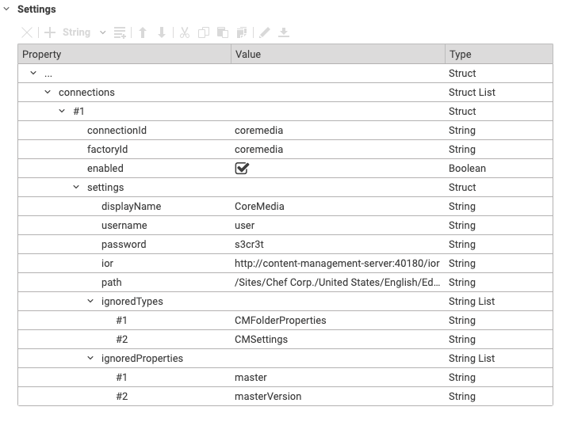

# Editorial Quick Start

--------------------------------------------------------------------------------

\[[Up](README.md)\] \[[Top](#top)\]

--------------------------------------------------------------------------------

## Introducing

The CoreMedia Content Hub Adapter provides a browsable tree of another configured CoreMedia Content Cloud environment and allows business users to import content from this environment. 

The image below is showing the result after successfully configuring the adapter.

## Basic adapter configuration
This section covers the two possibilities to enable the Content Hub Adapter. Please note that those options are valid for all Content Hub Adapters.

Before configuring the adapter, please refer to the documentation in [Deployment Manual - Content Hub Configuration](https://documentation.coremedia.com/cmcc-11/artifacts/2110/webhelp/deployment-en/content/Studio-Contenthub-Configuration.html) for preliminary steps.

### Global Adapter Configuration
To configure the Content Hub Adapter for all sites, it is necessary to create a `CMSettings` document at the following location configured as `contenthub.studio.global-configuration-path` (Default `/Settings/Options/Settings/Content Hub`).

### Site-specific Adapter Configuration
To configure the Content Hub Adapter for a single site, it is necessary to create a `CMSettings` document at the location configured as `contenthub.studio.site-configuration-path` (Default: 	`/Options/Settings/Content Hub`).

## Detailed Adapter Configuration

### Basic structure
The table below is shows the initial toplevel entry for all Content Hub connector configurations.

| Key         | Type       | Required   |
|-------------|------------|------------|
| `connections` | StructList | Yes        |

After creation of the initial struct list called `connections`, the next step is to create the first entry. This can be done in Studio with the struct editor by pressing _Add item to ListProperty_. The table below shows all configuration options available for this adapter.

| Key           | Type       | Value                 | Required   |
|---------------|------------|------------           |------------|
| `connectionId`  | String      | <YOUR_CHOOSEN_ID>    | Yes        |
| `factoryId`     | String      | `coremedia` | Yes        |
| `enabled`       | Boolean     | true or false        | Yes        |
| `settings`       | Struct     |                      | Yes        |
| `settings.displayName`       | String     | Optional display name to use for the root folder of this connection.                      | No        |
| `settings.username`       | String     | Username to access the connected CoreMedia Content Cloud environment.                      | Yes        |
| `settings.password`       | String     | Password to access the connected CoreMedia Content Cloud environment.                      | Yes        |
| `settings.ior`       | String     | CMS IOR to access the connected CoreMedia Content Cloud environment.                      | Yes        |
| `settings.path`       | String     | Optional repository path in the connected CoreMedia Content Cloud environment. Defaults to `/` if ommited. | No        |
| `settings.ignoredTypes`       | StringList     | Optional list of content types that should be ignored. Defaults to `CMAction`, `CMFolderProperties`, `CMPerson`, `CMResourceBundle`, `CMSettings`, `CMSite`, `CMSitemap`, `CMSymbol`, `CMTemplateSet`, `CMTheme`, `CMViewtype`, `CMALXPageList`, `CMALXEventList`, `CMMail`, `ESDynamicList`, `CMMarketingSpot`, `CMExternalChannel`, `CMExternalProduct`, `CMExternalPage`, `CMProductList`, `CMSelectionRules`, `CMSegment`, `CMUserProfile`, `CMP13NSearch` if ommited. | No        |
| `settings.ignoredProperties`       | StringList     | Optional list of property names that should be ignored when items are imported. Defaults to `contexts`, `ignoreUpdates`, `linkedSettings`, `locationTaxonomy`, `master`, `masterVersion`, `resourceBundles`, `resourceBundles2`, `subjectTaxonomy`, `templateSets`, `viewtype` if ommited. | No        |

**Example Configuration**

