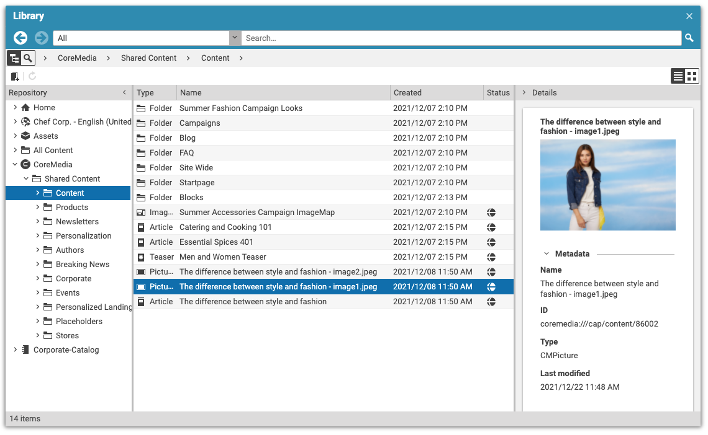

# Editorial Quick Start

--------------------------------------------------------------------------------

\[[Up](README.md)\] \[[Top](#top)\]

--------------------------------------------------------------------------------

## Introducing

The coremedia-contenthub-adapter provides a browsable tree of the current (preferred)
site. The image below shows the result after successfully configuring the adapter.

# Basic configuration
The navigation adapter comes with some minor configuration options (basically the common )

## Browsing the content-hub-adapter-coremedia
Depending on the configuration of the adapter, the appearance of the tree may vary. The following sections 
take care of all configuration **places** and **options**.

## Basic adapter configuration
This section covers the two possibilities to enable the content-hub-adapter-coremedia integration. Please note that those
options are valid for all content-hub-adapters. Before configuring the adapter, please refer to the documentation [Content hub configuration](https://documentation.coremedia.com/cmcc-10/artifacts/2004/webhelp/deployment-en/content/Studio-Contenthub-Configuration.html)
for preliminary steps.

### Global adapter configuration
To enable the content-hub-adapter-coremedia for all sites, it is necessary to create a CMSettings document inside the location:
* contenthub.studio.global-configuration-path
For convenience reasons, naming proposal of this document is "coremedia" (postfix of the plugin name)

### Site specific adapter configuration
To enable the content-hub-adapter-coremedia for a single site, it is necessary to create a CMSettings document inside the location:
* contenthub.studio.site-configuration-path
For convenience reasons, naming proposal of this document is "coremedia" (postfix of the plugin name)

## Detailed adapter configuration

### Basic structure
The table below shows the initial toplevel entry for all content-hub-connector configurations.

| Key         | Type       | Required   |
|-------------|------------|------------|
| connections | StructList | Yes        |

After creation of the initial struct list called **connections** the next step is to create the first entry. This can be done 
in Studio with the struct editor by pressing "add Item to ListProperty". The table below shows the entries which are common for all connectors.

| Key           | Type       | Value                 | Required   |
|---------------|------------|------------           |------------|
| connectionId  | String      | <YOUR_CHOOSEN_ID>    | Yes        |
| factoryId     | String      | coremedia | Yes        |
| enabled       | Boolean     | true or false        | Yes        |
| settings       | Struct     |                      | Yes        |

Finally you need to configure the connector.

| Key           | Type       | Value                 | Required   |
|---------------|------------|------------           |------------|
| path          | String     | Restrict access to specific paths within the remote repository    | No        |
| username      | String     | Username for the connection (e.g. admin)        | Yes |
| password      | String     | Password for the connection (e.g. admin)        | Yes        |
| ior           | String     | IOR for the connection                     | Yes        |
| ignoredTypes  | String     | Comma separated list of doctypes to exclude                     | No        |
