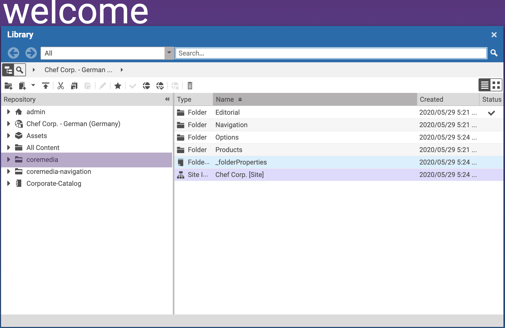
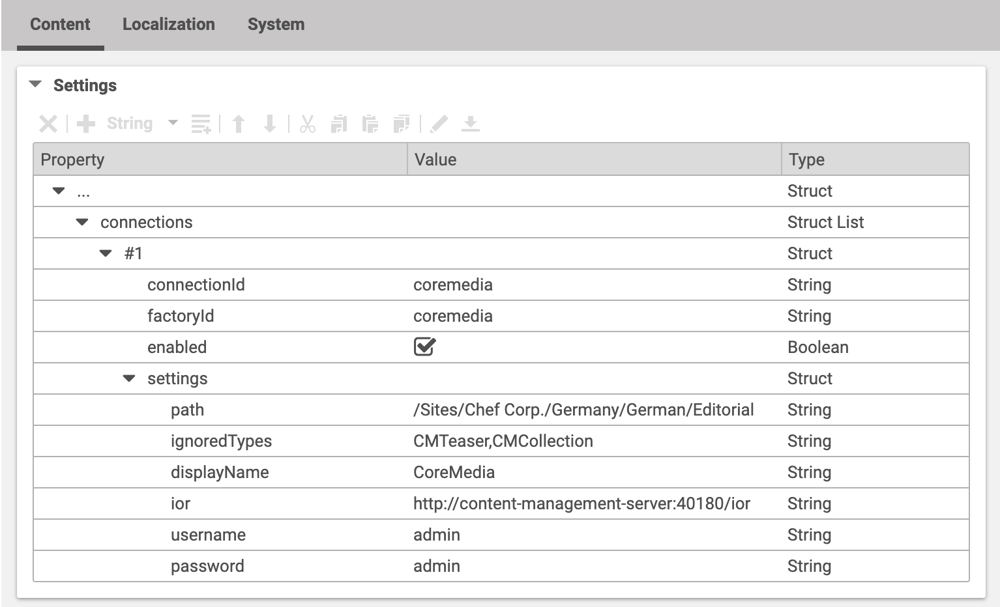
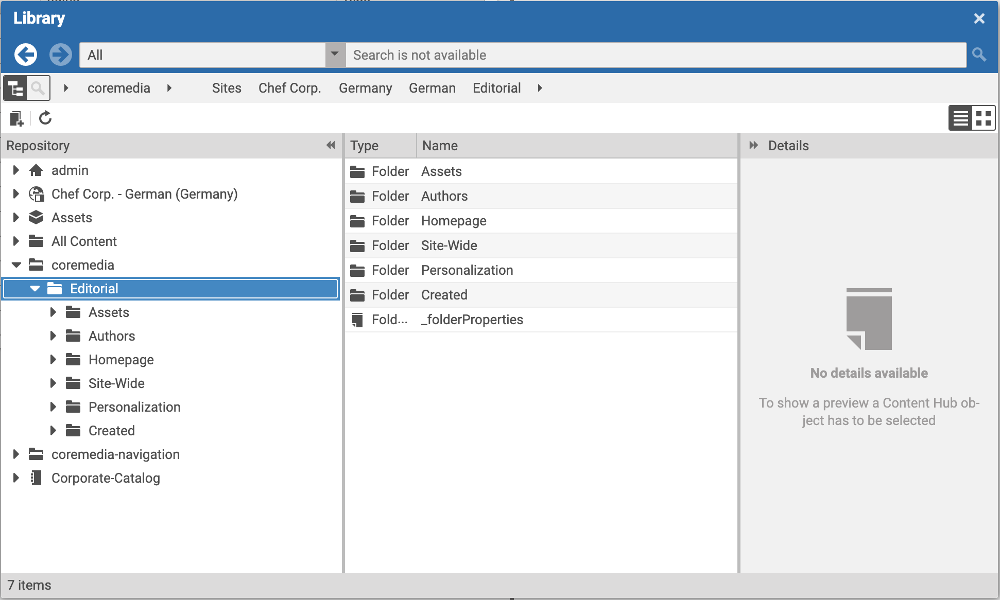
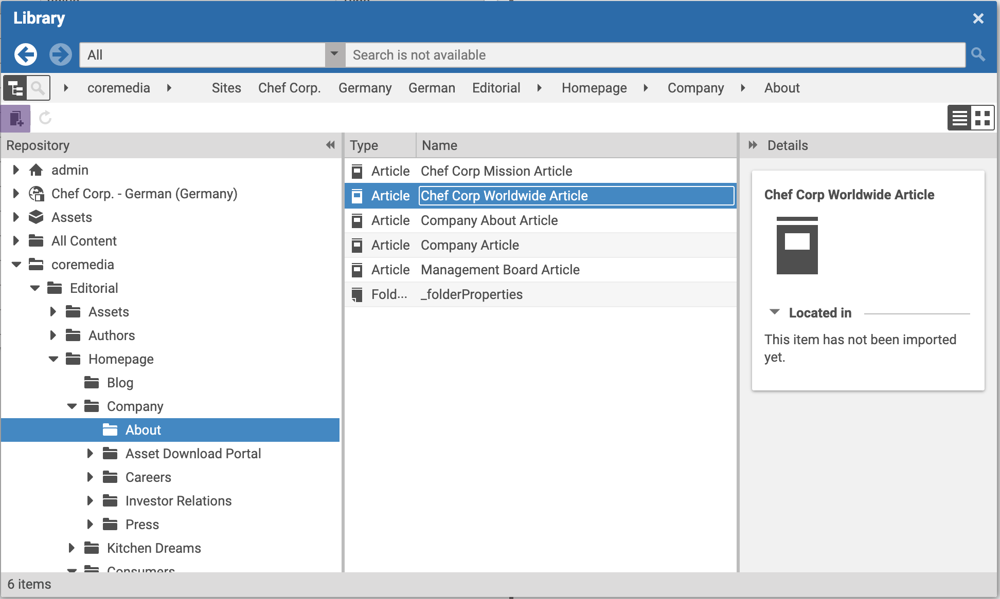

# Editorial Quick Start

--------------------------------------------------------------------------------

\[[Up](README.md)\] \[[Top](#top)\]

--------------------------------------------------------------------------------

## Table of contents

* [Introducing](#introducing)
* [Browsing the content-hub-adapter-coremedia](#browsing-the-content-hub-adapter-coremedia)
    * [Basic adapter configuration](#basic-adapter-configuration)
        * [Global adapter configuration](#global-adapter-configuration)
        * [Site specific adapter configuration](#site-specific-adapter-configuration)
    * [Detailed adapter configuration](#detailed-adapter-configuration)
        * [Basic structure](#basic-structure)
        * [Required configuration](#required-configuration)
        * [Example](#example)     
* [Usage](#usage)    

## Introducing

As mentioned in the main documentation, the coremedia-content-hub-coremedia extension
is providing access to a configurable CoreMedia content repository (CMS). Common to all
content-hub-adapters is the appearance in CoreMedia studio. The image below is showing 
multiple configured content-hub-adapters in Studio (cntent-hub-adapter-coremedia is marked with a purple background).

  
## Browsing the content-hub-adapter-coremedia
Depending on the configuration of the adapter, the appearance of the tree may vary. The following sections 
are taking care of all configuration **places** and **options**.

### Basic adapter configuration
This section is covering the two possibilities to enable the content-hub-adapter-coremedia integration. Please note that those
options are valid for all content-hub-adapters. Before configuring the adapter, please refer to the documentation [Content hub configuration](https://documentation.coremedia.com/cmcc-10/artifacts/2004/webhelp/deployment-en/content/Studio-Contenthub-Configuration.html)
for preliminary steps.

#### Global adapter configuration
To enable the content-hub-adapter-coremedia for all sites, it is necessary to create a CMSettings document inside the location:
* contenthub.studio.global-configuration-path
For convenience reasons, naming proposal of this document is "coremedia" (postfix of the extension name)

#### Site specific adapter configuration
To enable the content-hub-adapter-coremedia for a single site, it is necessary to create a CMSettings document inside the location:
* contenthub.studio.site-configuration-path
For convenience reasons, naming proposal of this document is "coremedia" (postfix of the extension name)

### Detailed adapter configuration

#### Basic structure
The table below is showing the initial toplevel entry for all content-hub-connector configurations.

| Key         | Type       | Required   |
|-------------|------------|------------|
| connections | StructList | Yes        |

After creation of the initial struct list called **connections** the next step is to create the first entry. This can be done 
in Studio with the struct editor by pressing "add Item to ListProperty". The table below is showing the entries which are common for all connectors.

| Key           | Type       | Value                 | Required   |
|---------------|------------|------------           |------------|
| connectionId  | String      | coremedia            | Yes        |
| factoryId     | String      | <YOUR_CHOOSEN_ID>    | Yes        |
| enabled       | Boolean     | true or false        | Yes        |
| settings       | Struct     |                      | Yes        |
          

#### Required configuration
In section [Basic structure](#basic-structure) and according to the table, the settings struct is currently empty.
The settings struct itself is holding specific configuration options for the connector (common to all connectors).
The table below is depicting all potentional entries. 

| Key               | Type       | Value                                                    | Required   |
|---------------    |------------|------------                                              |------------|
| ior               | String     | Url to the repository ior                                | Yes        |
| username          | String     | repository username                                      | Yes        |
| password          | String     | repository password                                      | Yes        |
| path              | String     |  Path to the folder assumed as the root folder           | No         |
| ignoredTypes      | String     |  Comma separated list of content-type names to ignore    | No         |

#### Example
The image below is depicting a full configuration of the content-hub-adapter-coremedia in global space

## Usage
Once the connector is configured, the coremedia named tree should appear inside the library, and by clicking on "coremedia"
the tree expands and is showing the well known folder-content structure. The image below is showing the expected appearance.

  

By browsing the tree, the content-hub-adapter-coremedia is providing an import mechanism for content objects. The picture below is showing the 
button for creation (purple background).

  

